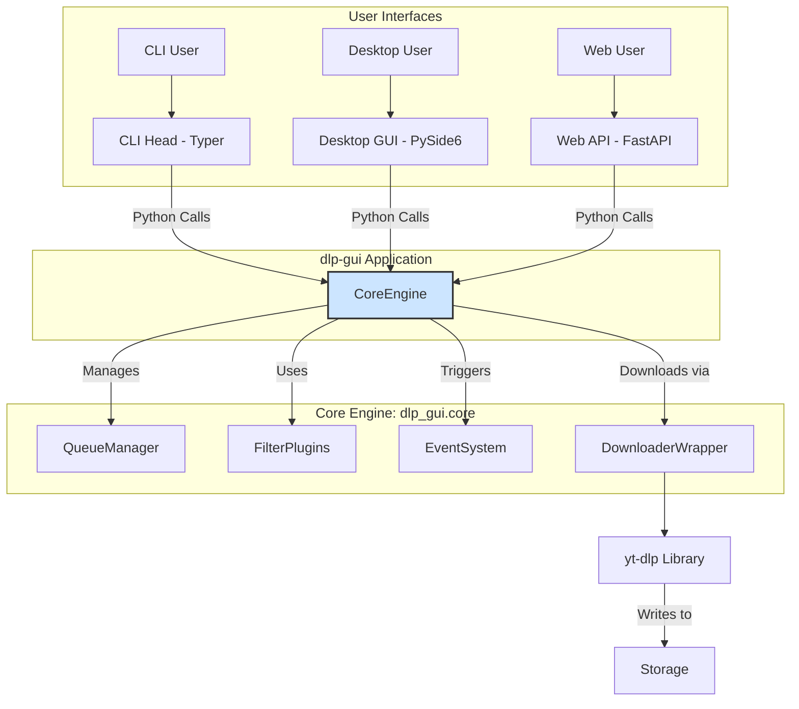
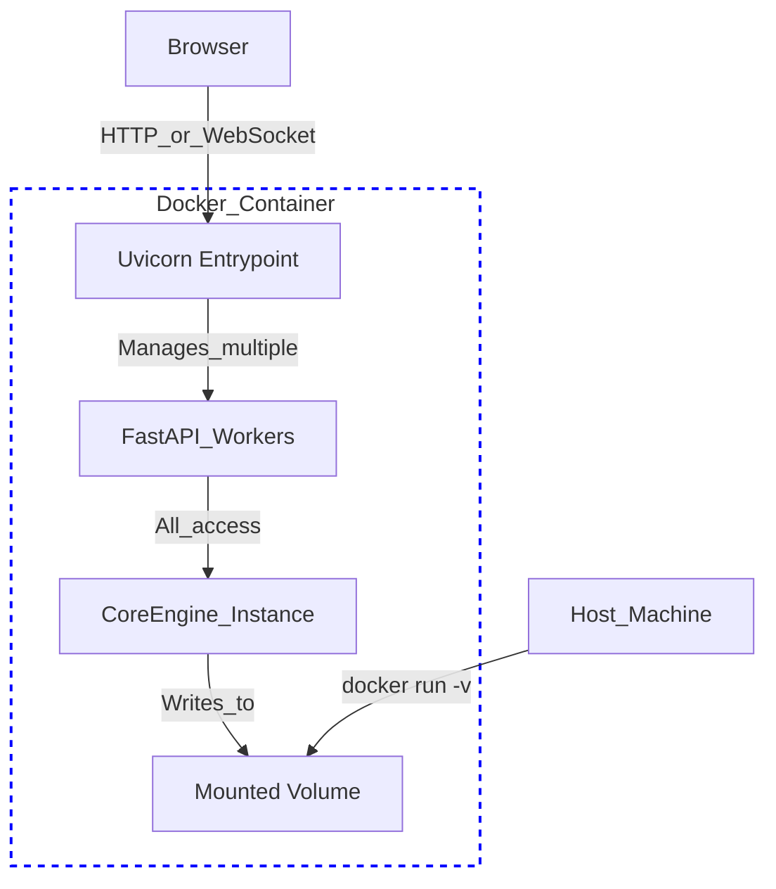

### Project `dlp-gui`: Build Plan

#### Core Philosophy
This plan follows a disciplined, phased approach. Each phase delivers a complete, valuable, and standalone product. We begin with the simplest possible solution and iteratively add complexity, ensuring that the project remains stable and manageable at every stage. The architecture is built on a **Decoupled Core Engine**, allowing for maximum code reuse across different user interfaces (CLI, Desktop, Web).

#### High-Level System Architecture



---

## Phased Implementation Plan

### Phase 0: The Command-Line Foundation
**Goal**: Create a robust CLI tool that validates the core download and filtering logic.
**Philosophy**: Start with the absolute simplest interface. This allows us to perfect the backend logic without the complexity of a GUI, providing a solid, testable foundation for everything that follows.

*   **Features**:
    *   URL input via command-line argument.
    *   Basic filtering using a local `blacklist.toml` file or a dynamic link to txt 'https://nsfw.oisd.nl' which updates daily.
    *   Simple progress bar in the terminal.
*   **Tech Stack**: Typer (or Click), `uv`, `rich` (for nice terminal UI).
*   **Success Criteria**: A user can run `python -m dlp_gui.cli https://some.url` and have it download successfully, or be blocked by the filter.

### Phase 1: Desktop MVP (Linux & Windows First)
**Goal**: Build a functional, single-window desktop application with the validated core logic from Phase 0.
**Philosophy**: Focus on the core desktop experience for the two largest user bases first. Defer macOS-specific challenges to avoid delaying initial progress.

*   **Architecture & Flow**:
    ```mermaid
    graph TD
        subgraph Desktop_App
            MainWindow -- User_Input --> URL_Input;
            URL_Input -- On_Download_Click --> Controller;
            Controller -- start_download --> CoreEngine;
        end

        subgraph Backend
            CoreEngine -- pre-flight_check --> Filter;
            CoreEngine -- creates --> DownloadWorker[QThread: Worker];
            DownloadWorker -- runs --> Downloader;
        end
        
        DownloadWorker -- progress_signal --> ProgressBar;
        DownloadWorker -- finished_signal --> Controller;
        
        style CoreEngine fill:#cce5ff,stroke:#333,stroke-width:2px
    ```
*   **Key Steps**:
    1.  Wrap the Phase 0 logic into the `dlp_gui.core` library.
    2.  Build the PySide6 UI.
    3.  Use `QThread` for non-blocking downloads.
    4.  Use `pathlib` for all file paths to ensure Windows/Linux compatibility.

### Phase 2: Full-Featured Desktop Application
**Goal**: Expand the MVP into a complete desktop tool with queueing, settings, and an extensible plugin system.
**Philosophy**: Deliver the features that transform the tool from a simple utility into a power-user's application.

*   **Database Evolution**: `No DB -> SQLite`
*   **New Features**:
    *   Tabbed Interface: Download, Queue, Settings, Logs.
    *   Queue Manager with persistent state via **SQLite**.
    *   Concurrent downloads managed by `QThreadPool`.
    *   **Plugin System**: Create a `dlp_gui/core/filters/` directory. The application will dynamically load any filter classes from this directory that inherit from a `BaseFilter`. This allows for easy extensibility in the future.
*   **Success Criteria**: Queue persists after app restart; user can run 3+ downloads concurrently; settings are configurable via the UI.

### Phase 2.5: macOS Support (Optional)
**Goal**: Port the now-stable desktop application to macOS.
**Philosophy**: Isolate platform-specific challenges. By waiting until the core feature set is complete, we can focus entirely on macOS compatibility without disrupting main development.

*   **Key Challenges to Address**:
    *   Application sandboxing and filesystem permissions (`~/Downloads` access).
    *   Creating a proper `.app` bundle.
    *   Code signing and notarization requirements for user trust.
*   **Success Criteria**: The macOS version has feature parity with the Windows/Linux version and installs cleanly via a signed DMG.

### Phase 3: Cross-Platform Distribution & Testing
**Goal**: Automate the packaging of the desktop app for all three platforms and establish a solid testing strategy.
**Philosophy**: Make the application professional, trustworthy, and easy to install. Automate everything to ensure quality and consistency.

*   **CI/CD Pipeline (GitHub Actions)**:

| OS | Output Artifacts | Status |
| :--- | :--- | :--- |
| `ubuntu-latest` | `AppImage`, `.deb` | Implemented First |
| `windows-latest` | `MSI`, portable `.exe`| Implemented First |
| `macos-latest` | `DMG` | Implemented After Phase 2.5 |

*   **Testing Strategy**:
    *   **Unit Tests**: `pytest` for the `core` library (downloader, queue, filters). Aim for >80% code coverage before moving to Phase 4.
    *   **Integration Tests**: Test a full download cycle against a known-good URL.
    *   **UI Tests**: `pytest-qt` to test critical UI interactions (e.g., clicking download, adding to queue).
    *   **API Tests**: To be added in Phase 4 using FastAPI's `TestClient`.

### Phase 4: Web UI & Monolithic Containerization
**Goal**: Create a web-based UI and package the entire backend as a **single, simple-to-deploy Docker container**.
**Philosophy**: Enable remote access and containerization in the most straightforward way possible. Avoid the complexity of microservices until scale demands it.

*   **"Monolithic Container" Architecture**:





*   **Key Steps**:
    1.  Build the FastAPI web app in `dlp_gui/web`.
    2.  Create a single `Dockerfile` that installs dependencies via `uv`.
    3.  The `CMD` will start the Uvicorn server, potentially with multiple workers (e.g., `uvicorn ... --workers 4`). This is sufficient for many use cases and keeps the setup simple.
    4.  The container uses the **same SQLite database file** within its persistent volume for state management.

### Phase 5: Service Decomposition (Advanced)
**Goal**: Break the monolithic container into distinct services for improved scalability and resilience.
**Philosophy**: Only introduce the complexity of a distributed system when the benefits (scalability, fault tolerance) are required.

*   **Database Evolution**: `SQLite -> PostgreSQL (Optional)`
*   **Architecture**:
    ```mermaid
    graph TD
        User -- Request --> API[FastAPI Container];
        API -- Enqueues_Job --> Queue[Redis or RabbitMQ];
        Queue -- Delivers_Job --> Worker[Worker Container];
        
        Worker -- Performs_Download --> Storage;
        Worker -- Updates_Status --> DB[PostgreSQL DB];
        API -- Reads_Status --> DB;
        
        subgraph "docker-compose.yml"
            API;
            Queue;
            Worker;
            DB;
        end
    ```
*   **Technical Enhancements**:
    *   **Task Queue**: Start with Python's `concurrent.futures.ProcessPoolExecutor` running in a separate process before introducing Celery or RabbitMQ.
    *   **Resilience**: Implement retry logic with exponential backoff for failed downloads and API calls to the filter service.
    *   **Circuit Breaker**: Add a circuit breaker pattern (e.g., using the `pybreaker` library) when calling external filter APIs to prevent cascading failures.

### Phase 6: Production-Ready Orchestration
**Goal**: Provide turn-key deployment solutions for both simple and complex production environments.
**Philosophy**: Empower users with flexible deployment options. Recognize that Kubernetes is powerful but not always necessary.

*   **Deliverables**:
    1.  **Production `docker-compose.yml`**: A Compose file optimized for single-host production deployments, including service health checks and restart policies.
    2.  **Kubernetes Manifests (Optional)**: Helm charts or Kustomize configurations for deploying to a Kubernetes cluster.
    3.  **Infrastructure as Code (Optional)**: A basic Terraform module to provision the necessary infrastructure for a deployment on a cloud provider (e.g., AWS ECS or GCP Cloud Run).
*   **Monitoring**: Start with structured JSON logging, which is easily consumable by services like Datadog or an ELK stack. Introduce a Prometheus metrics endpoint as a secondary step.

---

## Consolidated Architectural Decisions

### Final Project Structure
```
dlp-gui/
├── .github/workflows/      # CI/CD pipelines
├── configs/                # Example configurations
│   └── config.example.toml
├── src/dlp_gui/
│   ├── __init__.py
│   ├── core/
│   │   ├── __init__.py
│   │   ├── downloader.py     # yt-dlp wrapper
│   │   ├── queue.py          # Queue manager (SQLite/Postgres backend)
│   │   ├── events.py         # Pub/Sub event system for progress updates
│   │   ├── filters/          # Filter plugin system
│   │   │   ├── __init__.py
│   │   │   ├── base.py
│   │   │   └── blacklist.py
│   │   └── storage/          # Storage abstraction layer
│   │       ├── base.py
│   │       └── local.py
│   ├── desktop/              # PySide6 application
│   ├── web/                  # FastAPI application
│   └── cli.py                # Typer CLI application
├── pyproject.toml            # Project definition and dependencies for uv
└── tests/
    ├── core/
    ├── desktop/
    └── web/
```

### Key Professional Considerations

*   **Configuration**: Use **TOML** (`config.toml`) for all user-facing configuration. It's more readable and less error-prone than YAML.
*   **Licensing**: Choose an open-source license (e.g., MIT, GPLv3) early in the project (Phase 0/1).
*   **Security**:
    *   Always sanitize and validate URLs.
    *   Implement rate limiting in the web API (Phase 4).
    *   Use modern security headers (CSP, etc.) for the web frontend.
*   **Error Recovery**: Design the download process to be resumable from the beginning (Phase 2). `yt-dlp` has options for this that should be leveraged.
*   **Performance Benchmarks**:
    *   **Desktop**: < 150MB RAM while idle.
    *   **Web API**: Handle at least 50 concurrent API requests on a 2-vCPU machine.
    *   **Download Speed**: Achieve >95% of the speed of running `yt-dlp` directly.
